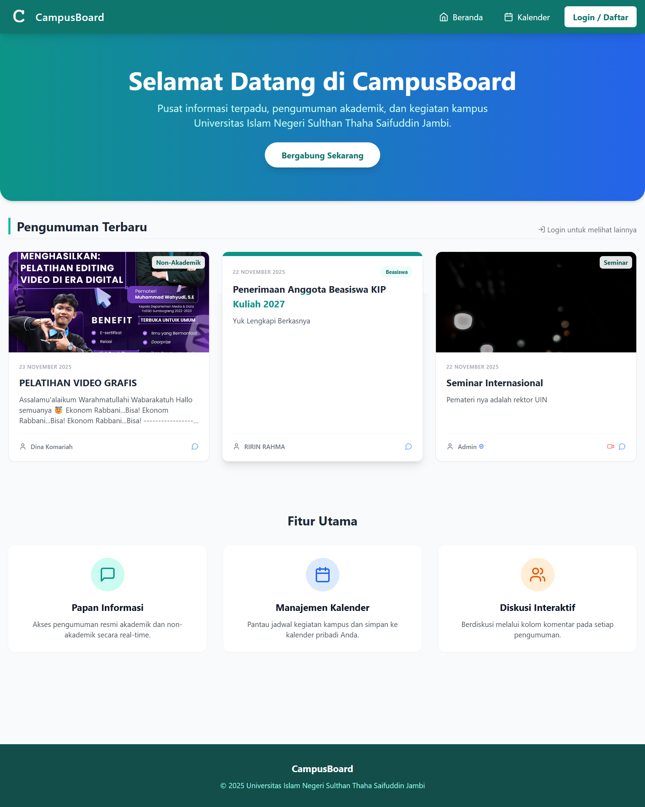

# 🎓 CampusBoard - Pusat Informasi Kampus Terpadu

<div align="center">

---

## 👥 Tim Pengembang

<table>
  <tr>
    <td align="center">
      <br />
      <sub><b>Indo Masse</b></sub><br />
      <sub>701230001</sub><br />
    </td>
    <td align="center">
      <br />
      <sub><b>Ririn Rahmawati</b></sub><br />
      <sub>701230036</sub><br />
    </td>
    <td align="center">
      <br />
      <sub><b>Dina Komariah</b></sub><br />
      <sub>701230065</sub><br />
    </td>
  </tr>
</table>

---

**CampusBoard** adalah aplikasi berbasis web yang berfungsi sebagai papan informasi digital untuk lingkungan kampus UIN Sultan Thaha Saifuddin Jambi. Aplikasi ini memusatkan penyebaran pengumuman akademik, acara kemahasiswaan, dan kalender kegiatan dalam satu platform yang mudah diakses.

</div>

---

## 🎯 Tujuan & Masalah yang Diselesaikan

### 🔴 Masalah:
Informasi kampus sering tercecer di grup WhatsApp, tertimbun chat, atau hanya ditempel di papan fisik yang jarang dibaca.

### ✨ Solusi:
CampusBoard menyediakan centralized hub di mana Admin dapat menyebarkan info resmi yang dapat diakses kapan saja secara real-time, dan Mahasiswa dapat berdiskusi serta menyimpan jadwal penting ke kalender pribadi.

---

## 🛠 Teknologi yang Digunakan

### Frontend
- **Vite Framework:** React.js
- **Styling:** Tailwind CSS
- **Language:** JavaScript (ES6+), HTML5

### Backend
- **Authentication:** Firebase Auth
- **Database:** Google Cloud Firestore (NoSQL)

### Tools & Libraries
- **Deployment:** Firebase Hosting
- **Package Manager:** NPM

---

## 🚀 Cara Menjalankan Aplikasi CampusBoard
Aplikasi ini dibangun menggunakan React (Vite), jadi kita akan menggunakan Node.js dan npm (Node Package Manager).

### Langkah Instalasi

1. **Cara Instalasi**
   Langkah ini dilakukan sekali saja untuk mengunduh semua library yang dibutuhkan (React, Tailwind, Firebase).
   - Buka Terminal: Buka proyek Anda (CampusBoard1) di Visual Studio Code, lalu buka Terminal (View > Terminal).
   - Instalasi Dependency: 
   ```bash
   npm install
   ```
   - Install library Tailwind dan PostCSS: 
   ```bash
   npm install -D tailwindcss postcss autoprefixer
   ```
   - Install SweetAlert2: 
   ```bash
   npm install sweetalert2
   ```

2. **Cara Konfigurasi (Menghubungkan ke Firebase)**
  Aplikasi tidak akan bisa memuat data atau fitur login/register jika belum terhubung ke database Anda.
   - Temukan File Konfigurasi: Buka file `src/config/firebase.js.`
   - Isi Data API: Pastikan kode di dalam file tersebut berisi detail proyek Firebase Anda (yang Anda dapatkan dari Firebase Console).
   ```File: src/config/firebase.js
    const firebaseConfig = {
      apiKey: "YOUR_API_KEY_HERE", // <-- GANTI DENGAN KUNCI ASLI ANDA
      authDomain: "YOUR_AUTH_DOMAIN",
      projectId: "YOUR_PROJECT_ID",
      // ... lainnya
    };
    ```
   - Login Firebase (Jika ingin deploy): Jika Anda ingin menguji login dan fitur secara lokal dengan akun Firebase, jalankan: 
   ```bash
   firebase login
   ```

3. **Cara Menjalankan**
  Setelah semua package terinstal, Anda siap menjalankan aplikasi di browser.
   - Jalankan Server Development: Di Terminal, jalankan perintah standar Vite: 
   ```bash
   npm run dev`
   ```
   - Akses Aplikasi: Terminal akan menampilkan alamat lokal, biasanya: http://localhost:5173/

---

## 🔐 Akun Demo (Untuk Pengujian)
Jika Anda ingin mencoba fitur tanpa mendaftar, gunakan akun berikut:

### Admin
```
Email   : campusboard1@gmail.com
Password: Admin123
```

### User
```
Email   : Mahasiswa58@gmail.com
Password: Mhs12345
```

---

## 🔗 Link Deployment & Demo

### 🌐 Aplikasi Web: 
https://campusboard1-c6e50.web.app/

### 📺 Video Demo:
https://youtu.be/TrxqJQ2iDiA?si%253DYqfjFtpKQ3SyTbsT

---

## 📸 Screenshot

<div align="center">

</div>

---

## 📝 Catatan Tambahan
- Fitur "Lupa Password" memerlukan konfigurasi domain hosting di Firebase Console agar link email berfungsi dengan benar.
- Saat ini aplikasi berjalan optimal di browser Chrome dan Edge.

---

<div align="center">

**⭐ Dibuat untuk memenuhi tugas Final Project mata kuliah Rekayasa Perangkat Lunak Program Studi Sistem Informasi, UIN Sultan Thaha Saifuddin Jambi, 2025. ⭐**

</div>